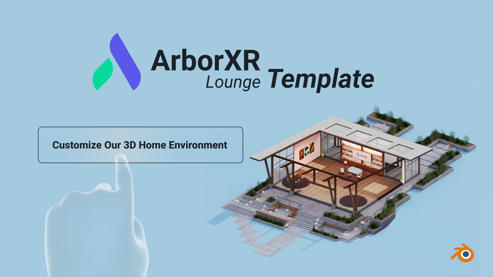

## Modeling guidlines to consider: #

### Polycount: ## 

Less than 100,000 polygons.

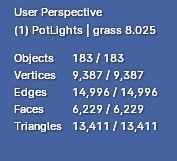 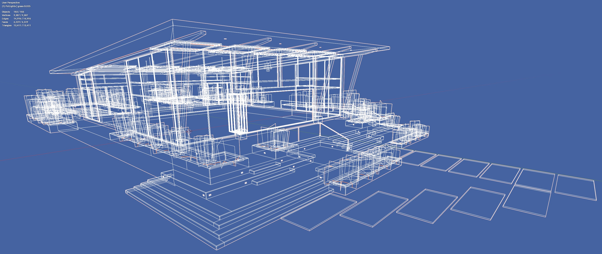

### Texture optimization: 

Please map as many models as possible to a single texture. Additionally, baking the lighting into the textures would be beneficial.

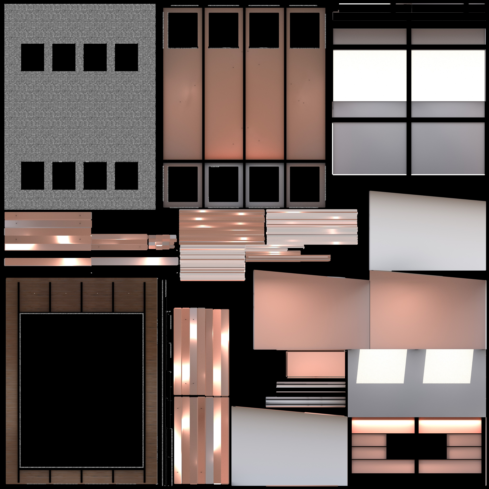 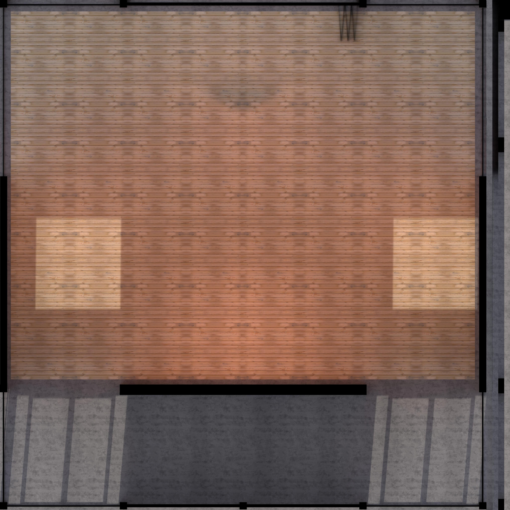 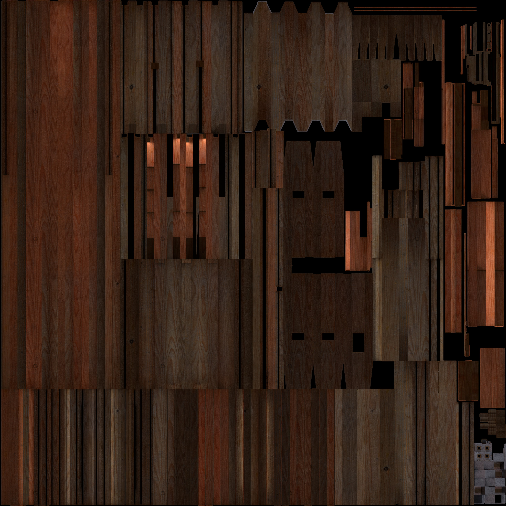 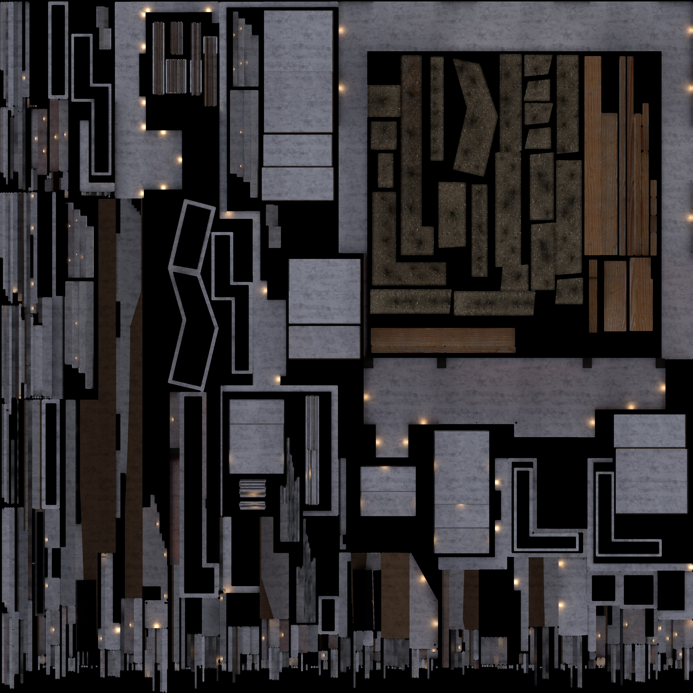

### Texture sizes: 
Keeping the texture resolutions low with memory, loading and performance. Please optimize them accordingly.

### Export settings: 

You can choose one of the following options based on your preference.

GLTF format with separate textures and a binary file (.gltf + textures + .bin)
GLTF format with embedded textures (.gltf with embedded textures)
GLB format with embedded textures (.glb with embedded textures)

### Total File Size:

Please try to keep the total file size smaller than 30mb. You can make it larger but it will take longer to load. 

##
### UV Editor
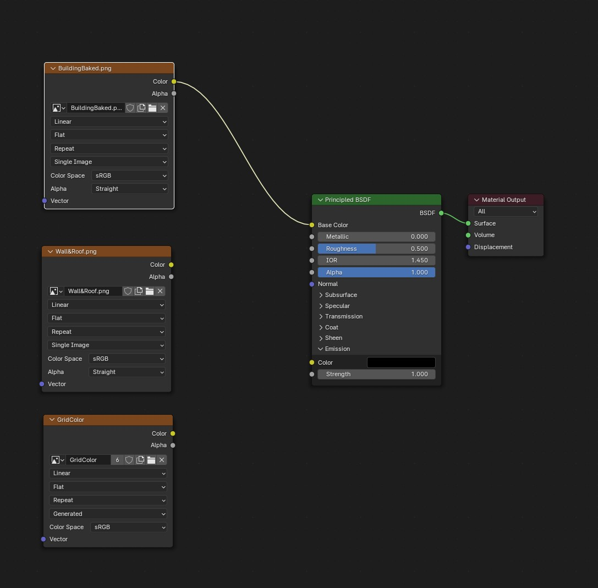

Under the UV Editor there are up to 3 textures to assign. There is a flat texture you can use when you want to assign and bake lights. There is a baked lightmap and UV Grid. 

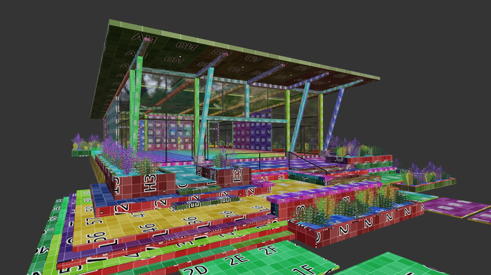 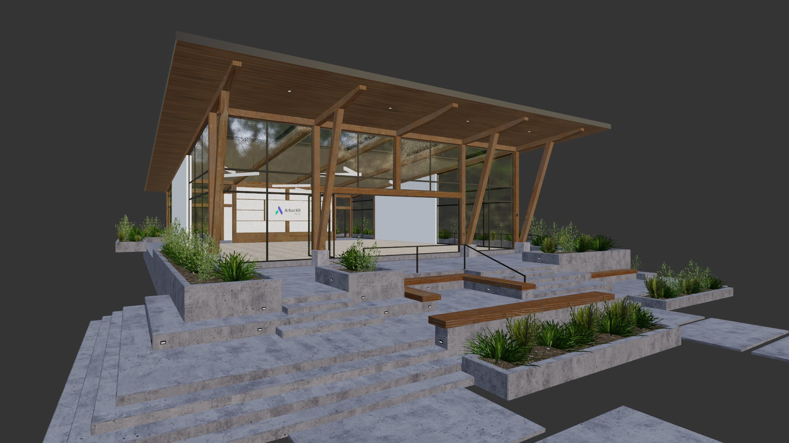 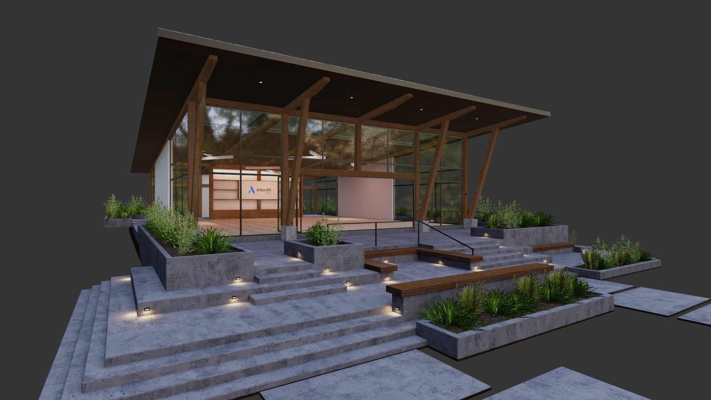

